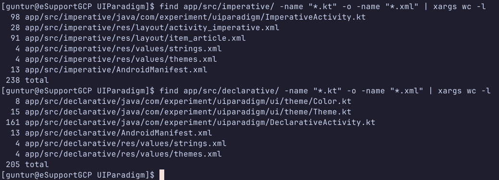

# Android UI Paradigm Experiment

### Imperative (XML/RecyclerView) vs Declarative (Jetpack Compose)

A controlled experiment measuring the practical differences between imperative and declarative UI paradigms in Android development across build metrics, runtime performance, and code complexity.

---

## Experiment Environment

| Property                 | Detail                                |
| ------------------------ | ------------------------------------- |
| **Host OS**              | NixOS 25.11                           |
| **Container**            | Distrobox — Arch Linux                |
| **JDK**                  | OpenJDK 21                            |
| **Android SDK**          | API 35, Build Tools 35.0.0            |
| **Storage**              | Direct bind-mount (max I/O)           |
| **Background isolation** | No background apps during measurement |

The experiment runs inside a Distrobox Arch Linux container on NixOS to guarantee absolute dependency reproducibility.

---

## Project Structure

```
app/src/
├── main/                           # Shared code
│   ├── AndroidManifest.xml
│   └── java/com/experiment/uiparadigm/
│       └── StaticData.kt           # Static article repository
├── imperative/                     # XML + RecyclerView implementation
│   ├── AndroidManifest.xml
│   ├── java/com/experiment/uiparadigm/
│   │   └── ImperativeActivity.kt
│   └── res/
│       ├── layout/
│       │   ├── activity_imperative.xml
│       │   └── item_article.xml
│       └── values/
└── declarative/                    # Jetpack Compose implementation
    ├── AndroidManifest.xml
    └── java/com/experiment/uiparadigm/
        ├── DeclarativeActivity.kt
        └── ui/theme/
```

Both implementations live in a **single Android project** using Gradle product flavors, ensuring identical compiler configuration and build tools across both paradigms.

---

## Subject Application

A simple news portal app displaying static articles. The app renders a filtered and sorted list of 10 articles with category badges, trending indicators, author, and read time.

**Imperative implementation** uses XML layouts, `RecyclerView`, and manual `for-loop` data transformations.

**Declarative implementation** uses Jetpack Compose with `LazyColumn` and functional operators (`filter`, `map`, `partition`, `sortedBy`).

---

## Measurement Protocol

**Static metrics** (collected post-build):

- Lines of Code via `wc -l`
- APK size via `ls -lh`

**Dynamic metrics** (collected on physical device):

- Cold Start via `adb shell am start -W` → `TotalTime`
- Peak RAM and CPU via Android Studio Live Telemetry Profiler

Each dynamic metric was measured after a `adb shell am force-stop` to guarantee a true cold start.

---

## Results

### Lines of Code


### Cold Boot


### Apk Size


### Telemetry
#### Imperative Telemetry


#### Declarative Telemetry


### Static Metrics

| Metric            | Imperative | Declarative | Δ                |
| ----------------- | ---------- | ----------- | ---------------- |
| **Lines of Code** | 238        | 205         | Declarative −14% |
| **APK Size**      | 6.3 MB     | 8.4 MB      | Declarative +33% |

> Shared `StaticData.kt` is excluded from both LOC counts.

### Dynamic Metrics

| Metric         | Imperative | Declarative | Δ                |
| -------------- | ---------- | ----------- | ---------------- |
| **Cold Start** | 477 ms     | 622 ms      | Declarative +30% |
| **Peak RAM**   | 131.9 MB   | 121.4 MB    | Declarative −8%  |
| **Peak CPU**   | 10%        | 6%          | Declarative −40% |

---

## Analysis

**Code complexity** favours Declarative — 14% fewer lines with no separate XML layout files, and data transformation expressed more concisely through functional operators compared to manual for-loops.

**APK size** favours Imperative — Compose ships its own UI toolkit (~2 MB overhead) whereas the XML path relies on system-level views already present on the device.

**Cold Start** favours Imperative — Compose's initial composition phase adds overhead at startup (622 ms vs 477 ms), a known characteristic of Compose on first render.

**Runtime efficiency** (RAM + CPU) favours Declarative — once running, Compose's reactive model consumes less memory and CPU than an active RecyclerView with its ViewHolder binding cycle. Peak RAM was 8% lower and CPU load was 40% lower during steady-state rendering.

---

## Key Takeaway

There is no universally superior paradigm. The choice involves real trade-offs:

- Choose **Imperative (XML)** when cold start time and APK size are critical constraints — e.g. lightweight utility apps on low-end devices.
- Choose **Declarative (Compose)** when developer velocity, code maintainability, and runtime CPU/RAM efficiency matter more — e.g. feature-rich apps with complex, dynamic UIs.

---

## Reproducing This Experiment

### Prerequisites

- NixOS with Distrobox + Podman
- Arch Linux container with OpenJDK 21 and Android SDK API 35

### Steps

```bash
# Clone the repo
git clone https://github.com/<your-username>/UIParadigm
cd UIParadigm

# Warm-up (downloads all Gradle plugins)
./gradlew dependencies --no-daemon

# Build imperative
./gradlew clean && time ./gradlew assembleImperativeDebug --no-daemon

# Build declarative
./gradlew clean && time ./gradlew assembleDeclarativeDebug --no-daemon

# Install on device
adb install app/build/outputs/apk/imperative/debug/app-imperative-debug.apk
adb install app/build/outputs/apk/declarative/debug/app-declarative-debug.apk

# Measure cold start
adb shell am force-stop com.experiment.uiparadigm.imperative
adb shell am start -W com.experiment.uiparadigm.imperative/com.experiment.uiparadigm.ImperativeActivity

adb shell am force-stop com.experiment.uiparadigm.declarative
adb shell am start -W com.experiment.uiparadigm.declarative/com.experiment.uiparadigm.DeclarativeActivity
```

Runtime metrics (RAM + CPU) are collected via **Android Studio → Profiler → View Live Telemetry** while performing a cold launch.
